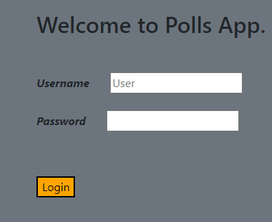

# Poll_App

## Contents
1. Description
2. Features
3. Installation
4. Usage
5. Package Requirements

## Description
A simple poll app that allows registered users vote on questions in an sql database. After voting, users are redirected to a page where they see results on their poll.

## Features
This app allows registered users to vote answers on questions.

## Installation
The app has not at the time of writing this.

## Usage
Full access is only given to registered users. New users are redirected to a login/sign up page.

Once any user logs in successfully, the user will have access to the questions which are pre-loaded in the question database. When the user votes, a confirmation page will be printed displaying the number of user votes on the question.

## Package Requirements
* Python 3
* Django 4.1.5
